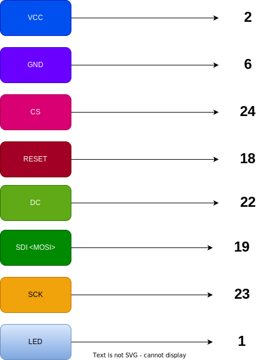

## J3 Robotics Falcon Mini Code - To Run on Toys

### Manual Start

Run `python3 main.py 2>/dev/null`

### Logs watch for services

#### Falcon Mini - The Main Program
`journalctl -f -u falcon_mini.service`

### Flask Service
`journalctl -f -u localserverj3.service`

